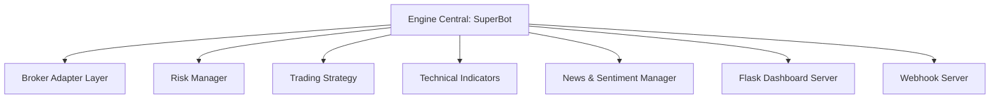

# NexQuant — Documentation Technique Complète

---

## 1. Vue d'ensemble de l'Architecture
NexQuant est un robot de trading algorithmique modulaire écrit en Python. Il utilise une architecture orientée services asynchrones avec un moteur de trading central (`SuperBot`) orchestrant plusieurs composants spécialisés.



### Principes Clés :
* **Asynchronisme multithread** : Le moteur tourne dans un thread principal tandis que le serveur Flask (dashboard) et le collecteur d'actualités tournent dans des processus/threads séparés pilotés par des événements (`threading.Event`).
* **Abstraction du Courtage** : L'accès aux marchés est standardisé par une classe de base abstraite. Le bot peut interagir de manière identique avec des marchés Crypto (Binance Futures), Actions US (Alpaca) ou Forex (Paper Forex) uniquement via configuration.
* **Sécurité & Contrôle des Risques** : Aucune position n'est ouverte sans validation préalable par le `RiskManager` (contrôle des drawdowns, taille de position dynamique Kelly, et limites d'exposition).

---

## 2. Structure Détaillée du Projet

```
nexquant/
├── .env                       # Configuration locale et clés API (exclu du Git)
├── .gitignore                 # Règles d'exclusion Git
├── TECHNICAL_DOCUMENTATION.md  # Cette documentation technique
├── README.md                  # Présentation générale du projet et démarrage rapide
├── CHANGER_DE_BROKER.md       # Guide spécifique aux changements de courtiers
├── EXPERT_TRADER_GUIDE.md     # Guide avancé des stratégies
├── MANUEL_UTILISATION.md      # Manuel utilisateur général
└── superbot/                  # Répertoire du code source
    ├── __init__.py
    ├── config.py              # Parsing et validation des variables .env
    ├── logger.py              # Système de journalisation (rotation de logs)
    ├── main.py                # Point d'entrée, cycle principal et boucle de trading
    ├── scheduler.py           # Planificateur de tâches pour les routines du bot
    ├── broker/                # Modules d'intégration aux brokers
    │   ├── __init__.py
    │   ├── base.py            # Classe abstraite Broker et Factory d'instanciation
    │   ├── binance_client.py  # Client de l'API Binance Futures (Testnet & Live)
    │   ├── alpaca_client.py   # Client de l'API Alpaca Markets (Actions US)
    │   └── paper_forex_client.py # Simulateur Forex local avec flux TwelveData/AlphaVantage
    ├── dashboard/             # Serveur Web et Dashboard de monitoring
    │   ├── __init__.py
    │   └── dashboard.py       # Serveur Flask et template HTML/CSS/JS embarqué
    ├── indicators/            # Calculs mathématiques d'indicateurs
    │   ├── __init__.py
    │   └── technical_indicators.py # Calculs (Pandas/NumPy) : EMA, RSI, MACD, ATR, Supertrend...
    ├── news/                  # Analyse fondamentale et sentiment
    │   ├── __init__.py
    │   └── news_manager.py    # Collecteur d'actualités financières et score de sentiment
    ├── risk/                  # Gestion du risque et de l'exposition
    │   ├── __init__.py
    │   └── risk_manager.py    # Calculs de tailles de lots, Stop Loss, Take Profit et drawdowns
    └── strategy/              # Algorithmes de décision (Signaux)
        ├── __init__.py
        ├── strategy.py        # Logique de décision (Trending vs Ranging) et scoring
        └── knowledge_base.py  # Base de calculs (Kelly, Risk-Reward, etc.)
```

---

## 3. Cycle de Vie et Moteur Central (`main.py`)

### Initialisation
Au démarrage, `SuperBot` exécute la séquence suivante :
1. **Chargement de la Configuration** : Lecture de `.env` et validation via `config.py`.
2. **Instanciation du Broker** : Appel à la factory `create_broker()` pour injecter le client adapté (`BinanceClient`, `AlpacaClient` ou `PaperForexClient`).
3. **Initialisation des Modules de Calcul** : Instanciation successive du `RiskManager`, de la `TradingStrategy` et du `NewsManager`.
4. **Chargement du Dashboard** : Configuration du serveur Flask sur le port 5000.
5. **Synchronisation Initiale des Positions** : Le bot appelle la fonction interne `_sync_positions_with_broker()`.

### La Boucle Principale (`_main_loop`)
La boucle s'exécute à intervalles réguliers (durée du cycle de veille ajustée en fonction de la granularité configurée, par exemple 1 heure) :
1. **Synchronisation d'état** : Appel à `_sync_positions_with_broker()`.
2. **Scan des Instruments** : Pour chaque actif de la liste (ex: `BTC/USDT`, `ETH/USDT`) :
   * Téléchargement des bougies historiques récentes via `broker.fetch_candles()`.
   * Envoi du DataFrame OHLCV à `strategy.analyze_market()`.
   * Si un signal est valide (`should_long` ou `should_short` est `True`) :
     * Validation par le `RiskManager` (vérification de la marge libre et du nombre de positions ouvertes).
     * Calcul final de la taille de lot réajustée avec la formule de Kelly.
     * Envoi de l'ordre de marché avec Stop Loss et Take Profit associés via `broker.place_order()`.
3. **Mise à jour du Dashboard** : Envoi des dernières statistiques, positions courantes et graphiques à l'interface Web.

### Mécanisme de Synchronisation (`_sync_positions_with_broker`)
Pour éviter toute désynchronisation entre l'état local du bot et l'état réel sur la plateforme d'échange (ex: positions coupées manuellement sur le téléphone, Stop Loss touché sans que le bot ne l'ait détecté) :
* À chaque itération de la boucle, le bot interroge le courtier pour récupérer la liste des positions ouvertes.
* Les positions locales (`self.positions`) et celles gérées par le `RiskManager` sont écrasées et remplacées par la réalité du broker.
* Les niveaux de prix de **Stop Loss** et de **Take Profit** sont dynamiquement mis à jour en scannant les ordres ouverts du broker.

---

## 4. Analyse Technique et Moteur de Stratégie

La classe `TradingStrategy` évalue le marché selon deux régimes distincts identifiés par l'ADX et le positionnement des moyennes mobiles : **TRENDING (Tendance)** et **RANGING (Marché latéral)**.

### Régime Tendance (TRENDING)
Activé si la tendance générale est forte. Le score (sur 10) est calculé sur l'alignement des critères suivants :
* Croisement d'EMA rapide et lente (EMA 9/21).
* Position du prix par rapport à la moyenne à long terme (EMA 200).
* Alignement sur unité de temps supérieure (HTF Alignment).
* MACD supérieure ou inférieure à son signal.
* Indicateur SuperTrend en accord.
* Puissance de l'ADX (confirmant l'impulsion).
* Filtre Alexander Elder Impulse System (vert pour achat, rouge pour vente).

### Régime Latéral (RANGING)
Activé en cas d'absence de direction claire. Le score évalue le potentiel de retour à la moyenne :
* Surachat / Survente du RSI (ex: RSI < 30 pour un achat).
* Croisement du Stochastique RSI dans les zones extrêmes.
* Position du prix dans le bas ou le haut des bandes de Bollinger.
* Proximité des niveaux de Supports et Résistances identifiés par pivots.
* Détection de patterns de chandeliers de retournement (Marteau, Shooting Star, Avalement).

### Règle Critique de Déclenchement (Trigger)
Pour éviter de chasser une tendance déjà vieille, l'entrée en position n'est autorisée **que sur la bougie exacte où le signal se déclenche** (croisement effectif). Si la tendance est déjà établie depuis plusieurs bougies, le score restera élevé mais la condition de trigger sera `False`, bloquant l'ordre.

---

## 5. Gestion des Risques (`RiskManager`)

Le `RiskManager` est le garde-fou du bot. Il détermine l'admissibilité de chaque transaction :
* **Calcul de la taille de lot** : La taille de la position est corrélée au capital total du compte, au Stop Loss ATR calculé, et au pourcentage de risque défini (`RISK_PCT`).
* **Fraction de Kelly** : Ajuste la taille théorique en fonction du taux de réussite historique et du ratio Risk-Reward estimé (plafonné par défaut à 2% du compte pour éviter la sur-exposition).
* **Drawdown maximal** : Si la perte quotidienne dépasse `MAX_DAILY_LOSS_PCT` ou mensuelle dépasse `MAX_MONTHLY_LOSS_PCT`, le trading est suspendu.
* **Limitation d'exposition (`MAX_OPEN_POSITIONS`)** : Si le nombre de positions actuellement ouvertes chez le broker atteint ce seuil, aucune nouvelle transaction ne peut être initiée.

---

## 6. Intégrations Brokers (Couche d'Abstraction)

```
                       ┌───────────────┐
                       │  Base Broker  │
                       └───────┬───────┘
                               │
         ┌─────────────────────┼─────────────────────┐
         ▼                     ▼                     ▼
┌─────────────────┐   ┌─────────────────┐   ┌─────────────────┐
│ BinanceClient   │   │  AlpacaClient   │   │PaperForexClient │
│ (Crypto USD-M)  │   │  (Actions US)   │   │ (Simu local FX) │
└─────────────────┘   └─────────────────┘   └─────────────────┘
```

### Binance Futures Client (`binance_client.py`)
* **Type de marché** : Contrats perpétuels à marge en USDT/USDC (USDⓈ-M Futures).
* **Solde de portefeuille** : Utilise le champ global `totalWalletBalance` de l'API Binance pour comptabiliser les actifs multi-devises en dépôt, garantissant l'exactitude du capital initial pour le calcul du P&L.
* **Effet de levier** : Configurable dans l'environnement (ex: Levier 5x ou 10x).

### Alpaca Client (`alpaca_client.py`)
* **Type de marché** : Actions et ETFs américains (Spot).
* **Contrainte temporelle** : Soumis aux heures de marché US (15h30–22h00 heure de Paris). En dehors de ces heures, les flux de données temps réel s'arrêtent et le bot se met en veille.

### Paper Forex Client (`paper_forex_client.py`)
* **Type de marché** : Paires de devises majeures (Forex).
* **Moteur interne** : Gère un solde virtuel complet stocké en local. Les prix en temps réel et historiques sont extraits gratuitement des APIs de fournisseurs comme TwelveData ou AlphaVantage via des requêtes REST.

---

## 7. Dashboard de Monitoring

Le tableau de bord utilise **Flask** et présente une interface web moderne :
* **Uptime et Uptime Réel** : Indique l'état du processus de trading principal en temps réel.
* **Graphiques Interactifs** : Utilisation de la librairie **ApexCharts** pour tracer les bougies historiques et courbes de prix. Les timestamps UNIX sont normalisés en millisecondes pour éviter les bogues de fuseau horaire selon les navigateurs.
* **Vue "Journaux Système"** : Intègre un lecteur asynchrone qui lit la fin du fichier de log (`superbot.log`) et l'affiche dans un terminal virtuel stylisé.
* **Nettoyage "Real-Only"** : Toutes les fonctions de transaction fictives (conversion rapide, boutons de dépôt/retrait, faux portefeuilles DeFi et Cold Storage) ont été supprimées de l'interface pour ne conserver que les données réelles issues du broker connecté.

---

## 8. Alertes Techniques & Dépannage

### Erreur Binance API : "Margin is insufficient" (Code -2019)
Cette erreur survient lorsque la marge requise pour ouvrir la position calculée par le bot est supérieure à la marge libre sur votre compte Binance Futures.
* **Causes fréquentes** : Solde en stablecoin (USDT/USDC) trop faible, effet de levier configuré trop bas par rapport à la taille de transaction minimale autorisée par Binance, ou volume minimum de lot trop grand pour un petit compte.
* **Résolutions** :
  1. Déposer de la marge (USDT) sur le compte Binance Futures.
  2. Ajuster à la baisse `RISK_PCT` (ex: `0.5` au lieu de `1.0`).
  3. Ajuster le levier via l'API ou directement sur le terminal Binance.

### Le bot ne prend aucune position
1. **Exposition maximale atteinte** : Vérifiez que le nombre de positions ouvertes n'est pas déjà égal ou supérieur à `MAX_OPEN_POSITIONS`. Si vous avez déjà 4 positions et que la limite est de 3, aucune entrée ne se fera.
2. **Pas de signal de croisement (Trigger)** : Même si un actif est fortement haussier (ex: score à 8/10), le bot n'entrera pas si le croisement des moyennes mobiles s'est produit il y a plusieurs bougies. Il attendra un nouveau signal de retournement ou de consolidation.
3. **Filtre de nouvelles actif** : Si une nouvelle économique à fort impact est attendue dans la fenêtre définie par `NEWS_AVOIDANCE_BEFORE` / `NEWS_AVOIDANCE_AFTER`, le bot filtre les signaux et refuse d'ouvrir des positions pour éviter la volatilité irrationnelle.
