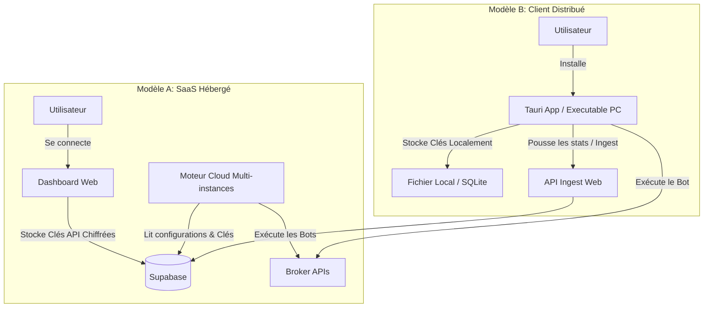

# Plan de Commercialisation — NexQuant Trading Bot

Ce document propose une feuille de route technique et fonctionnelle pour transformer le bot de trading NexQuant et son application Web en un produit commercialisable (SaaS).

---

## 1. Architecture de Distribution Cible

Pour commercialiser le bot, deux modèles principaux s'affrontent. La décision dépend de la responsabilité légale et de la complexité technique que vous souhaitez assumer.



### Comparaison des Modèles

| Critère | Modèle A : SaaS Hébergé (Cloud) | Modèle B : Client Distribué (Local/VPS) |
| :--- | :--- | :--- |
| **Expérience Client** | **Excellente** (Zéro installation, 1 clic pour démarrer). | **Moyenne** (Téléchargement, configuration locale). |
| **Responsabilité Légale** | **Haute** (Vous stockez les clés API des clients et gérez le serveur). | **Basse** (Les clés API restent sur la machine du client). |
| **Frais de Serveur** | **Élevés** (Serveur cloud pour faire tourner 100+ bots). | **Presque nuls** (Seul le serveur Web / Supabase tourne). |
| **Recommandation** | Recommandé si vous visez un grand public non technique. | Recommandé pour commencer rapidement sans risques légaux majeurs. |

---

## 2. Fonctionnalités Commerciales Indispensables

Pour rendre l'outil vendable, le dashboard actuel (`NexQuant Web App`) doit être enrichi des modules suivants :

### A. Sécurisation de l'Ingestion (Indispensable)
Actuellement, l'ingestion `/api/public/ingest` ne vérifie que la correspondance de l'en-tête `x-user-id`. Un utilisateur malveillant pourrait fausser les données d'un autre s'il devine son UUID.
* **Solution** : Implémenter une signature **HMAC-SHA256**.
  1. Générer un token secret unique dans le profil de l'utilisateur sur le dashboard.
  2. Le bot Python utilise ce secret pour signer le corps de la requête JSON.
  3. L'API d'ingestion recalcule la signature et rejette le payload s'il est invalide.

### B. Monétisation et Abonnements (Stripe / Lemon Squeezy)
* **Intégration** : Lier Supabase à Stripe ou Lemon Squeezy via webhooks.
* **Logique de blocage** : 
  * Créer une table `subscriptions` dans Supabase.
  * Dans le script Python, lors de l'appel régulier (heartbeat ou cycle), vérifier le statut de l'abonnement auprès du serveur. Si l'abonnement est inactif, le bot se met automatiquement en pause.

### C. Pilotage Bidirectionnel (Démarrage / Arrêt à distance)
Le dashboard contient déjà des boutons Démarrer/Arrêter, mais ils ne contrôlent pas encore activement le bot Python.
* **Option Polling** : Le bot interroge une table `bot_status` de Supabase toutes les 30 secondes pour savoir si `is_running` est `true` ou `false`.
* **Option Realtime (Websockets)** : Utiliser le client Supabase en Python pour écouter en temps réel les changements de statut de l'utilisateur.

---

## 3. Surveillance des Performances Multi-utilisateurs

En tant qu'administrateur du service commercial, vous devez savoir à tout moment si les bots de vos clients tournent correctement sans avoir accès à leurs ordinateurs.

### A. Dashboard Super-Admin
Créer une route sécurisée `/admin` accessible uniquement aux profils administrateurs de Supabase. Ce dashboard permettra de visualiser :

```
+-------------------------------------------------------------------------------+
|                        NEXQUANT ADMIN PORTAL                                  |
+-------------------------------------------------------------------------------+
| Utilisateur       | Statut Bot  | Broker  | Dernier P&L  | Alertes / Logs     |
+-------------------+-------------+---------+--------------+--------------------+
| jean.dupont@...   | RUNNING     | Binance | +4.2% (24h)  | OK                 |
| marie.curie@...   | DISCONNECTED| MT5     | —            | API Key Expired ⚠️ |
| dev.test@...      | STOPPED     | Alpaca  | -1.5% (7j)   | OK                 |
+-------------------------------------------------------------------------------+
```

### B. Gestion des Alertes (Heartbeat / Watchdog)
* **Watchdog de Heartbeat** : Un cron job côté serveur Web vérifie toutes les 5 minutes la colonne `last_heartbeat` de la table `bot_status`. Si la différence avec l'heure actuelle dépasse 5 minutes, le système envoie une alerte automatique à l'utilisateur (Email / Telegram) pour lui signaler que son bot s'est arrêté.
* **Centralisation des erreurs critiques** : Filtrer les logs ayant un niveau `error` poussés par les bots des clients pour les afficher sur la console admin afin de proactivement contacter un client en cas de problème de connexion de son courtier.

---

## 4. Déclinaisons Logicielles (Desktop et Mobile)

### A. Application de Bureau (Desktop App)
Si vous choisissez la **Route B (Client Distribué)**, l'utilisateur a besoin d'un logiciel facile à installer.
* **Recommandation : Tauri (React + Rust)**
  * **Pourquoi ?** Tauri génère des exécutables extrêmement légers (quelques Mo contre des centaines pour Electron) et sécurisés.
  * **Intégration du Bot** : Tauri permet d'inclure des "Sidecars". Vous pouvez compiler votre script Python en binaire (ex: via *PyInstaller*) et l'intégrer à Tauri. Tauri démarre et arrête le processus Python en tâche de fond de manière transparente.
  * **UI** : L'interface graphique de l'exécutable sera le même code React que votre application Web actuelle.

### B. Application Mobile (Téléphone)
* **Approche 1 : Progressive Web App (PWA)**
  * **Mise en œuvre** : Ajoutez un manifeste et un service worker au projet web React.
  * **Avantage** : Les utilisateurs peuvent installer le dashboard sur leur écran d'accueil en un clic sans passer par l'App Store / Google Play. C'est 100% compatible iOS & Android et gratuit.
* **Approche 2 : Capacitor (Ionic)**
  * **Mise en œuvre** : Enveloppe votre projet React/Vite existant dans une application native iOS et Android.
  * **Avantage** : Permet la publication sur les Stores et l'envoi de notifications push natives (ex: "Position XAUUSD fermée avec +50$ de profit").
