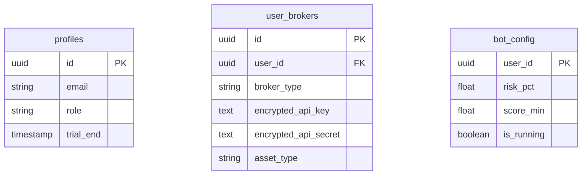

# Plan d'Architecture — NexQuant Option B (Client Distribué) — Version Commerciale

Ce document mis à jour intègre les nouvelles directives fonctionnelles pour le produit commercial NexQuant : sélection et détection automatique du marché, gestion centralisée des clés, auto-updates des clients, et modèle économique de type Bêta (1 mois gratuit) suivi d'un abonnement mensuel obligatoire.

---

## 1. Description du Flux Fonctionnel Utilisateur

```
[ ÉTAPE 1 : Inscription & Bêta ]
L'utilisateur s'inscrit sur l'App Web/Mobile.
Une période de Bêta (1 mois d'essai) s'active automatiquement.
                    |
                    v
[ ÉTAPE 2 : Choix du Broker & Clés API ]
L'utilisateur choisit son Broker sur l'interface (Binance, MT5 ou Alpaca).
Il renseigne ses clés API.
L'application stocke les clés de manière chiffrée (Supabase Vault) et détecte le type de marché :
  * Binance -> CRYPTO
  * MT5 -> FOREX
  * Alpaca -> ETF / STOCKS
                    |
                    v
[ ÉTAPE 3 : Lancement du Bot Client ]
Le client télécharge et lance son Bot local (Tauri ou binaire).
Il se connecte avec ses identifiants NexQuant.
Le Bot télécharge ses clés API de trading (déchiffrées en mémoire uniquement) et sa configuration.
                    |
                    v
[ ÉTAPE 4 : Exécution & Vérification Licence ]
À chaque cycle, le serveur valide l'état de l'abonnement/bêta.
Si l'essai de 1 mois a expiré et qu'aucun abonnement n'est actif :
  * Le serveur bloque l'API d'ingestion.
  * Le Bot reçoit un signal de blocage et s'arrête immédiatement.
```

---

## 2. Nouvelles Fonctionnalités Majeures

### A. Détection Automatique du Marché & Stratégie Adaptative
* **Logique de détection** :
  * La table `user_brokers` stocke le choix de l'utilisateur (`mt5`, `binance`, `alpaca`).
  * Le système associe automatiquement la stratégie correspondante :
    * `binance` $\rightarrow$ Stratégie Crypto (Scan SOL/USDT, rotation d'actifs, risques restreints).
    * `mt5` $\rightarrow$ Stratégie Forex (Volume en lots, pas de rotation, heures de trading flexibles).
    * `alpaca` $\rightarrow$ Stratégie ETF (Filtre de session US obligatoire).
* **Configuration unifiée** : Les paramètres stratégiques (`SCORE_MIN`, `RISK_PCT`) sont générés et ajustés en base de données selon le type de marché détecté, puis transmis au bot local.

### B. Stockage Centralisé et Chiffré des Clés API
Pour que l'expérience utilisateur soit simple (pas de manipulation de fichier `.env`), les clés API sont renseignées sur le site Web.
* **Sécurisation** : Utilisation de **Supabase Vault** (chiffrement pgsodium avec clé AES-256 gérée par le serveur).
* **Transmission** : Le bot local s'authentifie auprès de Supabase avec son jeton utilisateur pour récupérer les clés de trading à la volée. Ces clés ne sont stockées que dans la RAM du processus Python local, jamais écrites sur le disque dur du client.

### C. Système de Mise à Jour Automatique (Auto-Update)
Pour s'assurer que tous les clients exécutent la même version du code (correctifs de bugs, amélioration d'indicateurs) :
1. **Table `app_versions`** : Contient la dernière version disponible (ex: `v2.1.0`) et le lien du binaire.
2. **Vérification au démarrage** : Le bot local interroge le serveur au démarrage.
3. **Mise à jour automatique** : Si sa version locale est obsolète :
   * Le bot télécharge le nouveau package.
   * Il remplace ses propres fichiers et redémarre automatiquement.

### D. Bêta Gratuite (1 Mois) & Abonnement Obligatoire
* **Modèle Économique** : Abonnement mensuel récurrent (ex: 29$/mois) via Stripe.
* **Période d'essai** : Lors de la création du compte, un champ `trial_end` est calculé à `date_inscription + 30 jours`.
* **Vérification de licence** :
  * L'endpoint d'ingestion (`/api/public/ingest`) rejette les requêtes si `date_actuelle > trial_end` ET `subscription_status != 'active'`.
  * Si la requête d'ingestion échoue avec un code d'erreur de licence, le bot Python local coupe ses connexions de trading et affiche un message : *"Période d'essai expirée. Veuillez vous abonner sur le dashboard pour continuer."*

---

## 3. Schéma de Données Supabase Étendu



---

## 4. Open Questions & Choix de Conception

> [!IMPORTANT]
> **Validation du chiffrement des clés**
> Êtes-vous d'accord pour que le serveur Web déchiffre les clés API uniquement au moment où le bot client s'authentifie avec succès, afin d'éviter tout stockage en clair ? (C'est la méthode standard la plus sécurisée).

---

## 5. Plan de Vérification

1. **Test d'Auto-Détection** : Ajouter un broker Binance et vérifier que le système configure l'environnement en mode `CRYPTO`. Ajouter un broker MT5 et vérifier que l'environnement passe en `FOREX`.
2. **Test d'Expiration de Licence** : Forcer la date de fin d'essai d'un utilisateur dans le passé et vérifier que son bot s'arrête proprement avec le message d'erreur approprié.
3. **Test d'Auto-Update** : Publier une version supérieure fictive en base de données et s'assurer que le bot client télécharge la mise à jour et redémarre.
